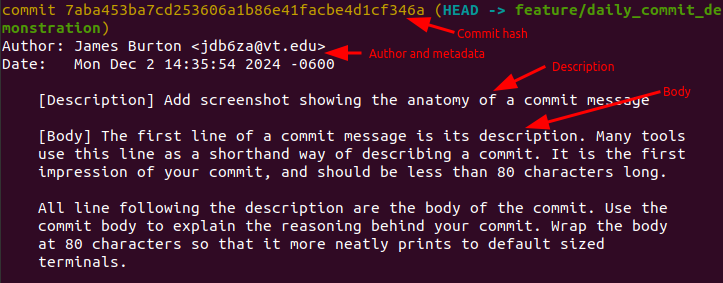

# Day 1 - Write Concise Commit Messages
Writing concise Git commit messages is one of the biggest improvements you can make in your coding process. 

## Reasons for Writing Concise Commit Messages
Concise messages help:

1. Improve readability, maintainability, and communication
   
   No one looks forward to reading a lengthy verbose complex sentence, when a short message will do. Succinct commit messages make it easier for future readers, including yourself, to follow your development progress.
2. Quicker code reviews
   
   Concise commit messages make it easier for reviewers to read through your code since they can read the commit message rather than diving into the code for each commit.
3. Build trust as a developer
   
   Experienced developers can tell when a developer knows what he or she is doing. In addition to good coding practices, writing good concise commits tells others that you care about your work. This builds trust with your colleagues that you have done your due diligence and will write good code in the future.

## Anatomy of a Commit Message
When reviewing Git commits, you will see four common parts (as shown below): Commit hash, metadata, commit description, and commit body. Today, we only concern ourselves with the commit description and body, which combine to form the commit message.

The first line of a commit message is its description. Many tools
use this line as a shorthand way of describing a commit. It is the first
impression of your commit.

All line following the description are the body of the commit. Use the
commit body to explain the reasoning behind your commit.

## Tips for Writing Concise Commit Messages
- Keep commit descriptions to less than 80 characters (less is better). This is about the width of a default terminal.
- Put additional explanation into the commit body
- Write in the imperative tense rather then past or present (i.e., `Add day 1 material`, not `Added...`)
- Be jealous of each character! You should explain your changes, but no more.
