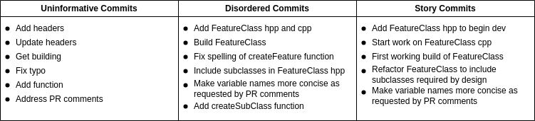

# Day 2 - Tell a Story with Your Commits 
Have you ever been engrossed in a story? Maybe a book you can't put down or a binge-watchable show? I expect that you remember the major plot points and big reveals, even of less interesting stories. 

## Why Commit a Story 
Stories have an incredible power to convey information and make it stick in peoples minds. While your commits will likely never compare to the latest streaming show, you can use the power of stories to leaving a lasting impression. By ordering commits in a logical fashion so that they build upon one another, you help to build a mental narrative in the mind of a reader. This narrative makes it more likely that a person (Including yourself!) will remember the key developments of your work. Telling a story through your commits shows that you put thought into the process and helps everyone remember what you did.

Conversely, a series of disconnected commits, or worse uninformative ones, make it harder to follow the development of your code. In such situations, reviewers will tend to only focus on the final code changes, albeit without the context of your developmental process.

## Comparison of Commit Messages
The image below is a contrived example that hopefully helps illustrate improvement of ordering your commits into a story. The leftmost pane shows uninformative commit messages. Although concise, these are rarely helpful. The middle pane shows better commit messages, but they are not arranged in a logical order. Most development looks like this list. The rightmost pane shows commits of the same work reordered into the beginning, middle, and end of a story.

## Tips for Story Telling through Commits
- Build a mental narrative of your work. You can't tell a story that you don't know.
- Where possible, order your work in a logical fashion. It is easier to tell a story if the order of your work naturally follows one. 
- Don't be afraid to reword or reorder commits to put them in a more linear order.
